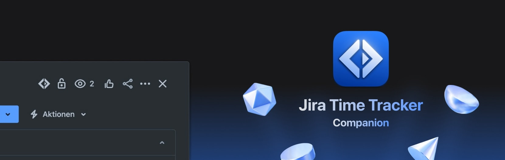

**Jira Time Tracker Companion** is a browser extension for [Jira Time Tracker](https://github.com/AdrianFahrbach/jira-time-tracker) that allows you to start timers directly from Jira issues in your browser. It is built with [Plasmo](https://plasmo.com/).
