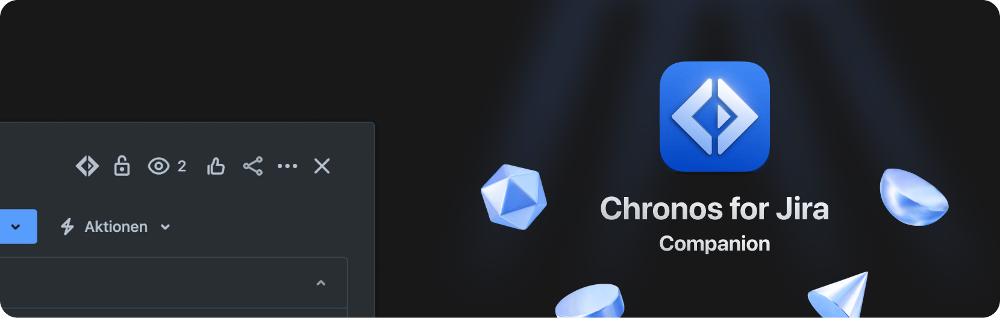

**Chronos Companion** is a browser extension for the [Chronos app](https://github.com/nice-af/chronos-app) that allows you to start timers directly from Jira issues in your browser. It is built with [Plasmo](https://plasmo.com/).

## Get started

You can start developing or building the Chronos Companion extension using the following command:

```bash
npm run dev
```

## Building and packaging

To create zip files of the extension you need to build them first and then package them. This can be done with the following commands:

```bash
npm run build
npm run package
```

## Publishing

The repo includes a GitHub Action that manually (needs to be activated) publishes the extension to the Chrome Web Store, Firefox Add-ons, and Microsoft Edge Add-ons when a new release is created.
Before publishing, you need to release a new version of the extension by running:

```bash
npm run release
```